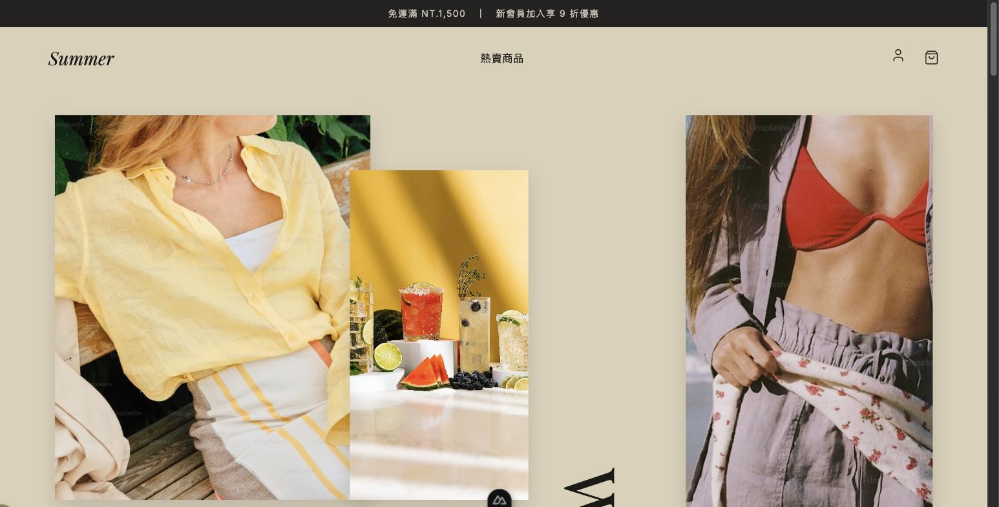

# Summer

編輯感拼貼風格的電商網站 demo，使用 Nuxt 4 + Vue 3 + Tailwind CSS + Pinia 打造。



## 功能亮點

- 商品瀏覽與分類篩選（洋裝／外套／配件／上衣）
- 購物車，含規格庫存上限檢查
- 註冊／登入／登出：以 cookie 模擬帳號資料庫，密碼經雜湊後比對，登入需先完成註冊才能成功，不是隨便輸入一組帳密就能通過
- 結帳流程與訂單查詢（訂單明細、歷史訂單列表）

## 技術棧

| 分類 | 選用 |
| --- | --- |
| 前端框架 | Nuxt 4、Vue 3 |
| CSS | Tailwind CSS v3 |
| 狀態管理 | Pinia |
| 語言 | TypeScript |
| Lint / Format | ESLint、Prettier |

## 快速開始

```bash
npm install
npm run dev
```

開發伺服器預設在 `http://localhost:3000`，不需要設定任何環境變數。

## 架構重點

目前是**純前端 demo**，沒有後端、沒有資料庫。商品目錄寫死在 `app/data/catalog.ts`，購物車／登入／訂單狀態全部透過瀏覽器 `useCookie` 模擬持久化——這是刻意的架構選擇，讓專案能在不依賴外部服務的情況下完整展示商品瀏覽到結帳的購物流程。完整的架構說明見 [doc/ARCHITECTURE.md](doc/ARCHITECTURE.md)。

## Demo

🔗 Live Demo：即將部署到 Vercel（敬請期待）

## 更多文件

`doc/` 目錄下有完整的專案文件，包含架構說明、開發規範、功能清單與錯誤處理、測試規範、更新日誌，見 [doc/README.md](doc/README.md) 索引。

目前尚未導入自動化測試（規劃中，見 [doc/TESTING.md](doc/TESTING.md)）。
